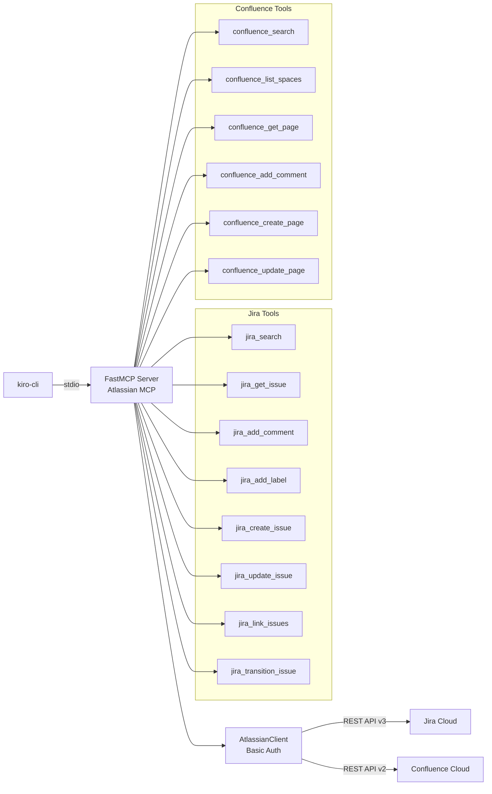
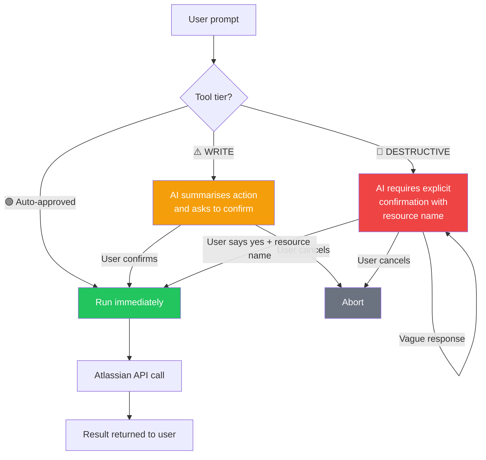

# Jira & Confluence MCP Server

A custom [Model Context Protocol](https://modelcontextprotocol.io) (MCP) server built with Python and FastMCP that gives AI assistants (like kiro-cli) full read/write access to **Jira Cloud** and **Confluence Cloud** via your API token — with tiered safety gating around write operations.

No delete operations are exposed. Destructive writes require explicit confirmation.

---

## Features

| Category | Tools |
|---|---|
| **Jira Read** | Search issues (JQL), get full issue details |
| **Jira Write (safe)** | Add comment, add label |
| **Jira Write (guarded)** | Create issue, update issue fields, link issues |
| **Jira Write (destructive)** | Transition issue status |
| **Confluence Read** | Search pages (CQL), list spaces, get page content |
| **Confluence Write (safe)** | Add comment to page |
| **Confluence Write (guarded)** | Create page |
| **Confluence Write (destructive)** | Update/overwrite page content |

---

## Architecture



## Safety Tier Flow



---

## Prerequisites

- Python 3.11+
- [uv](https://docs.astral.sh/uv/) — `curl -LsSf https://astral.sh/uv/install.sh | sh`
- An Atlassian Cloud account with Jira and/or Confluence
- An [Atlassian API token](https://id.atlassian.com/manage-profile/security/api-tokens)
- [kiro-cli](https://kiro.dev) installed

---

## Installation

```bash
git clone https://github.com/yourorg/jira-mcp-broader.git
cd jira-mcp-broader
uv sync
```

---

## Configuration

Copy `.env.example` to `.env` and fill in your credentials:

```bash
cp .env.example .env
```

```dotenv
# Required
JIRA_URL=https://yourcompany.atlassian.net
JIRA_USERNAME=your.email@company.com
JIRA_API_TOKEN=your_api_token_here

# Optional — defaults to JIRA_* values (same Atlassian Cloud domain)
# CONFLUENCE_URL=https://yourcompany.atlassian.net/wiki
# CONFLUENCE_USERNAME=your.email@company.com
# CONFLUENCE_API_TOKEN=your_api_token_here
```

### Environment Variables Reference

| Variable | Required | Default | Description |
|---|---|---|---|
| `JIRA_URL` | ✅ | — | Atlassian Cloud base URL, e.g. `https://company.atlassian.net` |
| `JIRA_USERNAME` | ✅ | — | Your Atlassian account email |
| `JIRA_API_TOKEN` | ✅ | — | API token from id.atlassian.com |
| `CONFLUENCE_URL` | ❌ | `$JIRA_URL/wiki` | Confluence base URL |
| `CONFLUENCE_USERNAME` | ❌ | `$JIRA_USERNAME` | Confluence account email |
| `CONFLUENCE_API_TOKEN` | ❌ | `$JIRA_API_TOKEN` | Confluence API token |

> **Note:** On Atlassian Cloud, Jira and Confluence share the same domain and credentials. You only need to set the `CONFLUENCE_*` variables if they differ.

---

## Kiro-cli Setup

### Option 1: Workspace config (recommended)

The `.kiro/settings/mcp.json` file is already included. Update the `--directory` path to match your clone location:

```json
{
  "mcpServers": {
    "atlassian": {
      "command": "uv",
      "args": ["run", "--directory", "/path/to/jira-mcp-broader", "python", "-m", "jira_confluence_mcp"],
      "env": {
        "JIRA_URL": "${env:JIRA_URL}",
        "JIRA_USERNAME": "${env:JIRA_USERNAME}",
        "JIRA_API_TOKEN": "${env:JIRA_API_TOKEN}"
      }
    }
  }
}
```

Set your credentials as shell environment variables (add to `~/.zshrc` or `~/.bashrc`):

```bash
export JIRA_URL=https://yourcompany.atlassian.net
export JIRA_USERNAME=your.email@company.com
export JIRA_API_TOKEN=your_api_token_here
```

Then verify the server loads:

```bash
kiro-cli mcp status --name atlassian-unlocked
```

### Option 2: Register globally via CLI

```bash
kiro-cli mcp add \
  --name atlassian-unlocked \
  --command uv \
  --args "run --directory /path/to/jira-mcp-broader python -m jira_confluence_mcp" \
  --env JIRA_URL=https://yourcompany.atlassian.net \
  --env JIRA_USERNAME=your@email.com \
  --env JIRA_API_TOKEN=your_token \
  --scope global
```

### Using the Atlassian agent

The `.kiro/agents/atlassian.json` agent is pre-configured with tiered tool permissions. Switch to it in kiro-cli:

```
/agent atlassian-unlocked
```

---

## Tool Reference

### Jira Tools

| Tool | Safety Tier | Description |
|---|---|---|
| `jira_search` | 🟢 Auto | Search issues using JQL |
| `jira_get_issue` | 🟢 Auto | Get full issue details by key |
| `jira_add_comment` | 🟢 Auto | Add a plain-text comment to an issue |
| `jira_add_label` | 🟢 Auto | Add a label without removing existing ones |
| `jira_create_issue` | ⚠️ WRITE | Create a new issue (requires confirmation) |
| `jira_update_issue` | ⚠️ WRITE | Update issue fields (requires confirmation) |
| `jira_link_issues` | ⚠️ WRITE | Link two issues together (requires confirmation) |
| `jira_transition_issue` | 🔴 DESTRUCTIVE | Move issue to a new workflow status (requires explicit approval) |

#### `jira_search`
```
jql: str          — JQL query, e.g. 'project = ENG AND status = "In Progress"'
max_results: int  — Max issues to return (default 20, max 50)
```

#### `jira_get_issue`
```
issue_key: str    — Issue key, e.g. ENG-123
```

#### `jira_add_comment`
```
issue_key: str    — Issue key
comment: str      — Plain text comment body
```

#### `jira_add_label`
```
issue_key: str    — Issue key
label: str        — Label to add (no spaces)
```

#### `jira_create_issue`
```
project_key: str              — Project key, e.g. ENG
summary: str                  — Issue title
issue_type: str               — Type name (default: Task)
description: str | None       — Optional plain-text description
assignee_account_id: str|None — Atlassian account ID
priority: str | None          — e.g. High, Medium, Low
labels: list[str] | None      — Label list
```

#### `jira_update_issue`
```
issue_key: str                — Issue key
summary: str | None           — New summary
description: str | None       — New description
assignee_account_id: str|None — New assignee account ID
priority: str | None          — New priority
labels: list[str] | None      — Replacement label list
```

#### `jira_transition_issue`
```
issue_key: str       — Issue key
transition_name: str — Target status name (case-insensitive), e.g. "In Progress", "Done"
```
If the transition name is not found, the tool returns the list of available transitions.

#### `jira_link_issues`
```
inward_issue_key: str   — Source issue key
outward_issue_key: str  — Target issue key
link_type: str          — Link type (default: blocks). Also: clones, duplicates, relates to
```

---

### Confluence Tools

| Tool | Safety Tier | Description |
|---|---|---|
| `confluence_search` | 🟢 Auto | Search pages using CQL |
| `confluence_list_spaces` | 🟢 Auto | List accessible spaces |
| `confluence_get_page` | 🟢 Auto | Get page content as plain text |
| `confluence_add_comment` | 🟢 Auto | Add a footer comment to a page |
| `confluence_create_page` | ⚠️ WRITE | Create a new page (requires confirmation) |
| `confluence_update_page` | 🔴 DESTRUCTIVE | Overwrite page content (requires explicit approval) |

#### `confluence_search`
```
cql: str     — CQL query, e.g. 'space = ENG AND title ~ "onboarding"'
limit: int   — Max results (default 20)
```

#### `confluence_list_spaces`
```
limit: int   — Max spaces to return (default 25)
```

#### `confluence_get_page`
```
page_id: str — Numeric page ID (visible in the page URL)
```

#### `confluence_add_comment`
```
page_id: str  — Numeric page ID
comment: str  — Plain text comment
```

#### `confluence_create_page`
```
space_id: str       — Numeric space ID (use confluence_list_spaces to find it)
title: str          — Page title
body: str           — Page content as plain text
parent_id: str|None — Optional parent page ID
```

#### `confluence_update_page`
```
page_id: str              — Numeric page ID
title: str                — New (or existing) page title
body: str                 — New content — replaces ALL existing content
version_message: str|None — Optional change description for page history
```

---

## Safety Tiers

The server uses a three-tier safety model enforced at two levels:

### Tier 1 — 🟢 Auto-approved
Read operations and low-risk writes (add comment, add label). These are listed in `allowedTools` in `.kiro/agents/atlassian.json` and run without any confirmation prompt.

### Tier 2 — ⚠️ WRITE
Operations that create or modify data. Tool descriptions are prefixed with `⚠️ WRITE`. The agent's system prompt instructs the AI to summarise the intended action and ask the user to confirm before calling these tools.

### Tier 3 — 🔴 DESTRUCTIVE
Operations that overwrite or irreversibly change state (transition issue status, overwrite Confluence page content). Tool descriptions are prefixed with `🔴 DESTRUCTIVE`. The agent must receive an explicit "yes" or "confirm" from the user — naming the specific resource — before proceeding.

### How kiro enforces this

- **`allowedTools`** in `.kiro/agents/atlassian.json` lists only the 8 auto-approved tools. All other tools require kiro's standard tool-use confirmation prompt.
- **Tool description prefixes** (`⚠️ WRITE`, `🔴 DESTRUCTIVE`) signal the AI to apply additional caution even when the tool is technically callable.
- **Agent system prompt** explicitly instructs the AI never to call destructive tools without a clear user confirmation.

---

## Usage Examples

See **[USAGE.md](USAGE.md)** for detailed scenario walkthroughs including:
- Daily standup queries
- Bug triage workflow
- Sprint planning (create + link issues)
- Code review transitions
- Confluence knowledge base management
- Publishing release notes
- Cross-tool Jira + Confluence workflows
- Safety gating confirmation examples

Quick examples — once on `/agent atlassian-unlocked`:

```
# Read operations (auto-approved, no confirmation needed)
"Find all open bugs in the ENG project assigned to me"
"Show me the details of ENG-456"
"What Confluence spaces do I have access to?"
"Get the content of Confluence page 123456"
"Search Confluence for pages about deployment runbooks"

# Write operations (AI will confirm before acting)
"Add a comment to ENG-123 saying the fix is deployed to staging"
"Create a bug ticket in ENG for the login timeout issue, high priority"
"Create a Confluence page in the ENG space titled 'Q3 Release Notes'"

# Destructive operations (AI will ask for explicit confirmation)
"Move ENG-123 to Done"
"Update the 'Onboarding Guide' Confluence page with this new content: ..."
```

---

## Development

### Running tests

```bash
uv run pytest
uv run pytest -v          # verbose
uv run pytest tests/test_jira_tools.py  # single file
```

### Testing the server interactively

```bash
# Start the MCP inspector (opens browser UI)
uv run mcp dev src/jira_confluence_mcp/server.py

# Or run the server directly (stdio mode, for debugging)
JIRA_URL=... JIRA_USERNAME=... JIRA_API_TOKEN=... uv run python -m jira_confluence_mcp
```

### Adding a new tool

1. Add the tool function inside `register(mcp)` in `jira_tools.py` or `confluence_tools.py`.
2. Prefix the docstring with `⚠️ WRITE` or `🔴 DESTRUCTIVE` as appropriate.
3. For auto-approved tools, add `@atlassian/<tool_name>` to `allowedTools` in `.kiro/agents/atlassian.json`.
4. Add a test in the corresponding test file.

### Project structure

```
src/jira_confluence_mcp/
├── server.py           # FastMCP server + lifespan (AppContext)
├── config.py           # Env var loading and validation
├── atlassian_client.py # Async HTTP client (get/post/put + error mapping)
├── jira_tools.py       # All 8 Jira tools
└── confluence_tools.py # All 6 Confluence tools

tests/
├── test_config.py
├── test_atlassian_client.py
├── test_jira_tools.py
└── test_confluence_tools.py

.kiro/
├── settings/mcp.json   # Workspace MCP server registration
└── agents/atlassian.json  # Agent with tiered allowedTools
```

---

## Troubleshooting

### `Missing required environment variables: JIRA_URL`
The server couldn't find your credentials. Make sure:
- You have a `.env` file in the project root, **or**
- The env vars are exported in your shell before starting kiro-cli.

### `Authentication failed — check JIRA_USERNAME and JIRA_API_TOKEN`
Your API token is wrong or expired. Generate a new one at [id.atlassian.com/manage-profile/security/api-tokens](https://id.atlassian.com/manage-profile/security/api-tokens).

### `Permission denied — your account lacks access to this resource`
Your Atlassian account doesn't have permission to access the project or space. Check your Jira/Confluence permissions.

### `Resource not found — verify the issue key, page ID, or project key`
The issue key, page ID, or project key doesn't exist or is misspelled. Use `jira_search` or `confluence_search` to find the correct identifiers.

### `Transition 'Done' not found for ENG-123`
The transition name doesn't match any available workflow transition. The tool will return the list of available transitions — use one of those exact names.

### `kiro-cli mcp status --name atlassian-unlocked` shows server not initialised
1. Check that `uv` is in your PATH: `which uv`
2. Check that the `--directory` path in `.kiro/settings/mcp.json` is correct and absolute.
3. Check that all required env vars are set: `echo $JIRA_URL`
4. Run the server manually to see the error: `uv run python -m jira_confluence_mcp`

---

## Security Notes

- Never commit your `.env` file. It's in `.gitignore` by default.
- API tokens grant the same access as your Atlassian account. Use least-privilege accounts where possible.
- The server only exposes read and write operations — no delete operations are implemented.
- All traffic goes directly from your machine to `*.atlassian.net` over HTTPS.
